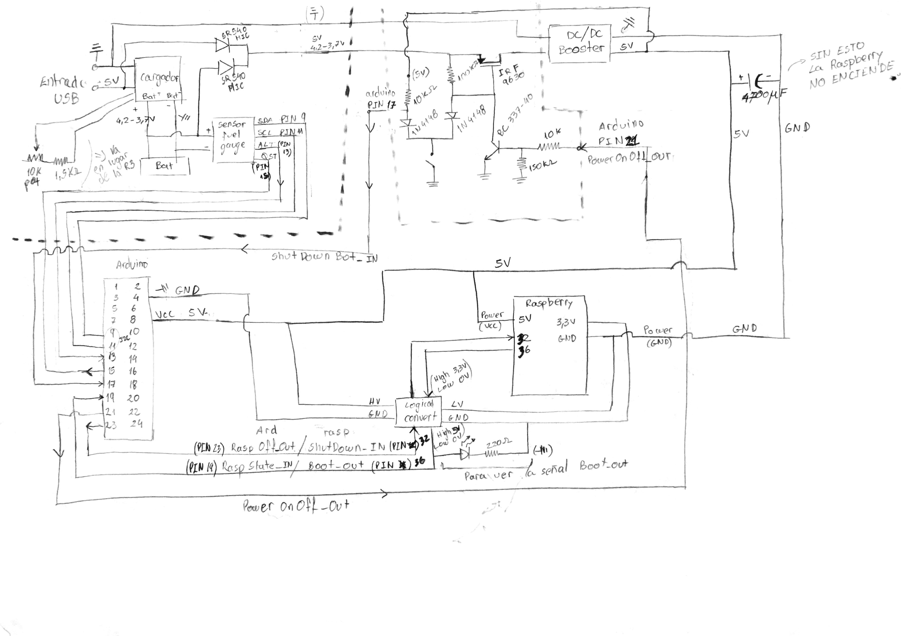

# Bandonberry

El proyecto Bandonberry tiene como objetivo crear un simulador electrónico para el aprendizaje del bandoneón. Pretende ser una alternativa económica en comparación con un bandoneón, de forma de permitir el acceso a un instrumento por parte de los estudiantes. No solo se limita a reproducir su forma y sonido, sino que incorpora tecnologías que ayudan y estimulan el proceso de aprendizaje.

## Raspberry Pi

[HARDWARE DOCUMENTATION](https://www.raspberrypi.org/documentation/hardware/raspberrypi/README.md)

Uso de pines:

|uso          |función        |pin     |pin     |función     |uso       |
|-------------|---------------|--------|--------|------------|----------|
|3.3 V        |3.3 V          |1       |2       |5 V         |5 V       | 
|PRESION      |I2C1 SDA       |3       |4       |5 V         |5 V       | 
|PRESION      |I2C1 SCL       |5       |6       |GND         |GND       | 
|SERVO        |GPIO 04        |7       |8       |UART0 TX    |          | 
|GND          |GND            |9       |10      |UART0 RX    |          | 
|BMS          |GPIO 17        |11      |12      |BITCLK      |AUDIO     |
|BOTON        |GPIO 27        |13      |14      |GND         |GND       |
|             |GPIO 22        |15      |16      |GPIO 23     |LED       |
|3.3 V        |3.3 V          |17      |18      |GPIO 24     |          |
|TECLADO      |SPI0 MOSI      |19      |20      |GND         |GND       |
|TECLADO      |SPI0 MISO      |21      |22      |GPIO 25     |          |
|TECLADO      |SPI0 SCLK      |23      |24      |SPI0 CS0    |TECLADO   |
|GND          |GND            |25      |26      |SPI0 CS1    |TECLADO   |
|             |EPROM          |27      |28      |EPROM       |          |
|             |GPIO 05        |29      |30      |GND         |GND       |
|             |GPIO 06        |31      |32      |GPIO 12     |BMS       |
|             |GPIO 13        |33      |34      |GND         |GND       |
|AUDIO        |LRCLK          |35      |36      |GPIO 16     |BMS       |
|             |GPIO 26        |37      |38      |GPIO 20     |          |
|GND          |GND            |39      |40      |DATAOUT     |AUDIO     | 

## RaspiATX

El mecanismo de apagado es el de [RaspiATX](https://github.com/LowPowerLab/ATX-Raspi).

Un script que corre en la raspberry monitorea el estado de un pin para enviar una señal de apagado en el sistema cuando se detecta un cambio en su estado. Una señal es enviada por otro pin para indicar el correcto booteo del sistema. Solo utilizamos los scripts provistos e implementamos en el BMS la funcionalidad del manejo de la energía.

Se copia el script de instalación: 
```
sudo wget https://raw.githubusercontent.com/LowPowerLab/ATX-Raspi/master/shutdownchecksetup.sh
```
Se editan los pines a usar ```sudo nano shutdownchecksetup.sh```:
```Python
SHUTDOWN = 12     # GPIO used for shutdown signal
BOOT = 16         # GPIO used for boot signal
```
Se instala eligiendo la opción 1:
```
sudo bash shutdownchecksetup.sh
sudo rm shutdownchecksetup.sh
sudo reboot
```

## Audio

[Adafruit MAX98357 I2S Class-D Mono Amp](https://learn.adafruit.com/adafruit-max98357-i2s-class-d-mono-amp/overview)

Dado que la raspberry no posee salida analógica de audio es necesario agregar hardware adicional para generar las señales de audio y amplificarlas. Optamos por dicho integrado dado que posee entrada digital I2S, presente en la raspberry, y provee una señal ya aplificada para ser conectada directamente a un parlante.

Para instalarlo correr el comando dos veces:
```
curl -sS https://raw.githubusercontent.com/adafruit/Raspberry-Pi-Installer-Scripts/master/i2samp.sh | bash
```

Para ver una lista de los dispositivos de audio:
```
aplay -l
```

Los auriculares con conexión de 3.5 mm poseen un terminal en común, configuración que no es posible llevar a cabo con estos integrados. La etapa de aplificación de este integrado tiene una configuración complementaria o diferencial, lo cuál implica que no es posible utilizar dos amplificadores para alimentar un par de auriculares. Dado el gran impacto que tiene en el diseño el cambio de este integrado se optó por conservarlo y eliminar la salida de audio de 3.5 mm.

Se puso una resistencia a Vcc en los pines SD para seleccionar el canal en cada amplificador:

- Izquierdo 150k
- Derecho 1M

## Fluidsynth

[FLUIDSYNTH USER MANUAL](https://github.com/FluidSynth/fluidsynth/wiki/UserManual)

Para generar el sonido de bandoneón utilizamos el sintetizador [Fluidsynth](http://www.fluidsynth.org/) en conjunto con una biblioteca de sonidos de uso libre creado por [Jörg Bleymehl](http://joergbleymehl.de/en/bandochords/soundfont/).

Para instalarlo:
```
sudo apt-get install fluidsynth
```
Para usar con las soundfonts de General MIDI:
```
sudo fluidsynth --audio-driver=alsa --gain 3 --verbose /usr/share/sounds/sf2/FluidR3_GM.sf2
```
Para usarlo con las soundfonts nuestras:
```
sudo fluidsynth --audio-driver=alsa --gain 3 --verbose /home/pi/Bandonberry/bandoneon_v2.sf2
```

Se siguieron los consejos encontrados en [FLUIDSYNTH WIKI](https://sourceforge.net/p/fluidsynth/wiki/LowLatency/) para reducir la latencia.

En particular se elige ```number of audio buffers = 2``` y ```audio buffer size = 64```.

Para que se inicie en el arranque se debe agregar la siguiente línea en ```/etc/rc.local```:
```
sudo fluidsynth -i -s -a alsa -g 3 -c 2 -z 64 /home/pi/Bandonberry/bandoneon_v2.sf2 &
```

## Rtmidi python

[RTMIDI PYTHON GITHUB](https://github.com/superquadratic/rtmidi-python)

Para instalarlo:
```
sudo apt-get install build-essential
sudo apt-get install libasound2-dev
sudo apt-get install libjack-jackd2-dev
sudo apt-get install python-dev python-pip
sudo pip install rtmidi-python
```

## GPIO expander

Las botoneras poseen una gran cantidad de botones (71 en total) y es necesario detectar el accionar de distintos botones de manera simultánea. Dado que la raspberry posee solo 26 entradas digitales se utiliza  un módulo expansor de puertos.

El chip [MCP23S17](http://ww1.microchip.com/downloads/en/DeviceDoc/20001952C.pdf) es SPI, se debe habilitar SPI desde ```sudo raspi-config``` como se explica en la [GUíA ADAFRUIT](https://learn.adafruit.com/adafruits-raspberry-pi-lesson-4-gpio-setup/configuring-spi).

### Linux driver

El driver por defecto es: [spi-bcm2708](https://github.com/raspberrypi/linux/blob/rpi-3.12.y/drivers/spi/spi-bcm2708.c).

Soporta las siguientes velocidades (2014-07-05):

|  cdiv|    speed|      config|
|------|---------|------------|
|     2|125.0 MHz|            |
|     4| 62.5 MHz|            |
|     8| 31.2 MHz|            |
|    16| 15.6 MHz|            |
|    32|  7.8 MHz| <- 10.0 MHz|
|    64|  3.9 MHz|            |
|   128| 1953 kHz|            |
|   256|  976 kHz|            |
|   512|  488 kHz|            |
|  1024|  244 kHz|            |
|  2048|  122 kHz|            |
|  4096|   61 kHz|            |
|  8192| 30.5 kHz|            |
| 16384| 15.2 kHz|            |
| 32768| 7629 Hz |            |

Una escritura o lectura necesita de la trasnmisión de 3 bytes **DEVICE OPCODE + REGISTER ADDRESS + REGISTER VALUE**.
A la frecuencia seleccionada dicha tarea tarda, teóricamente: 3 * 8 / (7.8 MHz / 2) = **6.2 us**.

### Librería

La librería [RPiMCP23S17](https://github.com/petrockblog/RPi-MCP23S17/blob/master/RPiMCP23S17/MCP23S17.py) no fincionó, basados en la misma se creó [BDN_MCP23S17.py](https://github.com/jebentancour/Bandonberry/blob/master/BDN_MCP23S17.py).

Requisitos previos:
```
sudo apt-get install python-dev python-pip
sudo pip install RPi.GPIO
sudo pip install spidev
```

Para usarlo (tiene que estar en el mismo directorio):
```Python
from BDN_MCP23S17 import MCP23S17
```

### Pinout

|uso       |función |pin     |pin     |función |uso       |
|----------|--------|--------|--------|--------|----------|
|COL 0     |B0      |1       |28      |A7      |FILA 7    | 
|COL 1     |B1      |2       |27      |A6      |FILA 6    | 
|COL 2     |B2      |3       |26      |A5      |FILA 5    | 
|COL 3     |B3      |4       |25      |A4      |FILA 4    | 
|COL 4     |B4      |5       |24      |A3      |FILA 3    | 
|COL 5     |B5      |6       |23      |A2      |FILA 2    |
|          |B6      |7       |22      |A1      |FILA 1    |
|          |B7      |8       |21      |A0      |FILA 0    |
|3.3 V     |VDD     |9       |20      |INTA    |          |
|GND       |VSS     |10      |19      |INTB    |          |
|CS0 o CS1 |nCS     |11      |18      |nRESET  |3.3 V     |
|SPI0 SCLK |SCK     |12      |17      |A2      |GND       |
|SPI0 MOSI |SI      |13      |16      |A1      |GND       |
|SPI0 MISO |SO      |14      |15      |A0      |GND       |

## PCB

Restricciones de JLCPCB:

|item               |mil   |mm    |
|-------------------|------|------|
|Min. Trace         | 5.000|0.127 |
|Min. Spacing       | 5.000|0.127 |
|Min. Via hole size |11.811|0.300 |
|Min. Via diameter  |23.622|0.600 |

## MIDI USB

[MIDI TUTORIAL](http://www.music-software-development.com/midi-tutorial.html)

Para ver una lista de los dispositivos MIDI:
```
aplaymidi -l
```

[Raspberry Pi Zero OTG Mode](https://gist.github.com/gbaman/50b6cca61dd1c3f88f41)

Para activar la interfaz MIDI USB:
```
echo "dtoverlay=dwc2" | sudo tee -a /boot/config.txt
echo "dwc2" | sudo tee -a /etc/modules
echo "g_midi" | sudo tee -a /etc/modules
sudo reboot
```

:warning: Esto cambia el dispositivo de reproducción por defecto, es necesario arreglar el inicio del sintetizador:

```
sudo fluidsynth -i -s -a alsa -o audio.alsa.device=hw:1,0 -g 3 -c 2 -z 64 /home/pi/Bandonberry/bandoneon_v2.sf2 &
```

## Sensor de presión

El chip [BMP180](https://cdn-shop.adafruit.com/datasheets/BST-BMP180-DS000-09.pdf) es I2C, se debe habilitar I2C desde ```sudo raspi-config``` como se explica en la [GUíA ADAFRUIT](https://learn.adafruit.com/adafruits-raspberry-pi-lesson-4-gpio-setup/configuring-i2c).

Para detectar los dispositivos I2C:

```
sudo i2cdetect -y 1
```

Si el sensor está bien conectado debe aparecer en la dirección 0x77.

### Librería

[Using the BMP085/180 with Raspberry Pi](https://learn.adafruit.com/using-the-bmp085-with-raspberry-pi/overview)

Para instalarla:

```
sudo apt-get update
sudo apt-get install git build-essential python-dev python-smbus
git clone https://github.com/adafruit/Adafruit_Python_BMP.git
cd Adafruit_Python_BMP
sudo python setup.py install
```

## BMS

### Arduino Pro Micro

[HARDWARE DOCUMENTATION](https://wiki.eprolabs.com/index.php?title=Arduino_Pro_Micro)

Uso de pines:

|uso            |función        |pin     |pin     |función     |uso               |
|---------------|---------------|--------|--------|------------|------------------|
|               |TX/D0          |1       |2       |RAW         |                  | 
|               |RX/D1          |3       |4       |GND         |                  | 
|               |GND            |5       |6       |RESET       |                  | 
|               |GND            |7       |8       |Vcc (5V)    |                  | 
|SDA_Fuel_Guage |SDA/D2         |9       |10      |A3          |                  | 
|SCL_Fuel_Guage |SCL/D3         |11      |12      |A2          |                  |
|AlertLowBat_IN |A6/D4          |13      |14      |A1          |                  |
|QuickStart_OUT |D5             |15      |16      |A0          |                  |
|ShutDownBot_IN |A7/D6          |17      |18      |D15/SCLK    |                  |
|RaspState_IN   |D7             |19      |20      |D14/MISO    |SelectBot_IN      |
|PowerOnOff_OUT |A8/D8          |21      |22      |D16/MOSI    |RBatCheck_OUT     |
|RaspOff_OUT    |A9/D9          |23      |24      |D10/A10     |SafeVoltageBat_Out|


``ShutDownBot_IN`` = Señal que recibe del botón de encendido/apagado.

``RaspState_IN`` = Señal de la raspberry que indica ``HIGH`` = No apagar, ``LOW`` = Se puede apagar.

``PowerOnOff_OUT`` = Señal que enciende el transistor, permitiendo alimentar todo el sistema. ``HIGH`` = Encendido todo el sistema, ``LOW`` = Se corta la corriente de todo el sistema (a no ser que se apreiete el botón de encendido). 

``RaspOff_OUT`` = Señal que indica a la raspberry que comience el proceso de preparación de apagado. (``HIGH`` 0.5 segundos es un reset, por más de 2 segundos es comienzo de proceso de apagado, y por más de 8 segundos es apagado forzado).

``SafeVoltageBat_Out`` = Señal que habilita la alimentación de la raspberry una vez que se chequé el voltaje de la batería. (AÚN NO ESTA EN EL PLANO)

La señal de ``Boot_IN`` se baja pero la luz de la raspberry se termina de apagar 8 segundos después, considerar ese delay en el código.



### Conexión con la Raspberry

``SHUTDOWN_IN = 12``    conectado a        ``RaspOff_OUT = 8``

``BOOT_OUT = 16``       conectado a        ``RaspState_IN = 6``        

### Medidor de batería

Utilizaremos un integrado [MAX17043](https://www.maximintegrated.com/en/products/power/battery-management/MAX17043.html) como medidor de la carga de la batería.

Para poder usarlo en Arduino nos bajamos la librerías de aqui [Librerias del MAX 17043 Fuel gauge](https://github.com/awelters/LiPoFuelGauge).

Sobre la programación y funciones de la librería [Funciones de libreria](http://www.lucadentella.it/max17043-libreria-per-arduino/).
