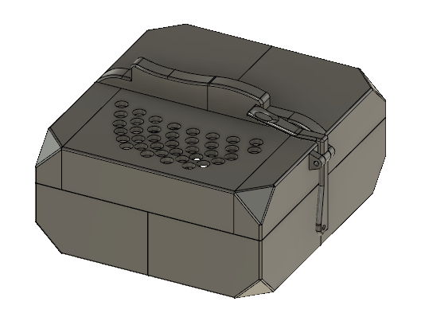
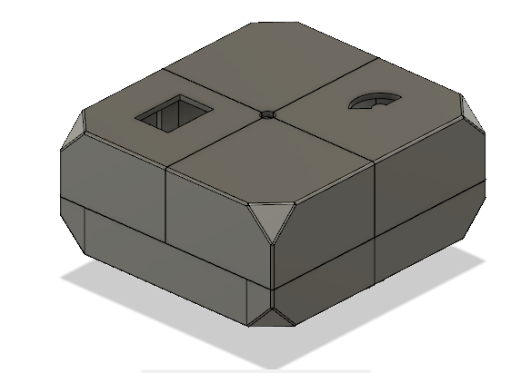
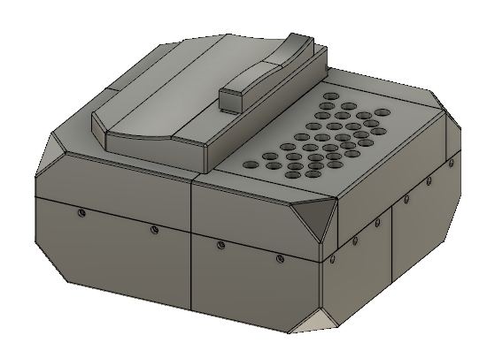
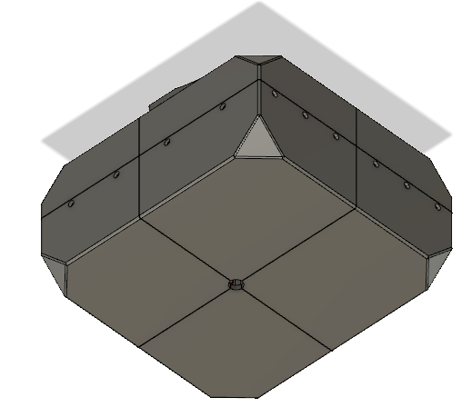
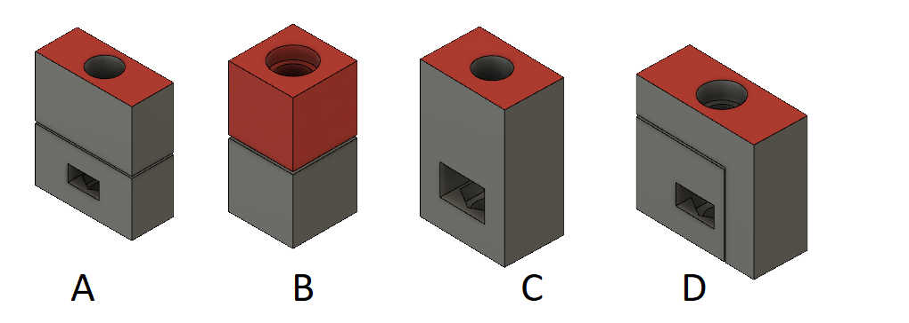
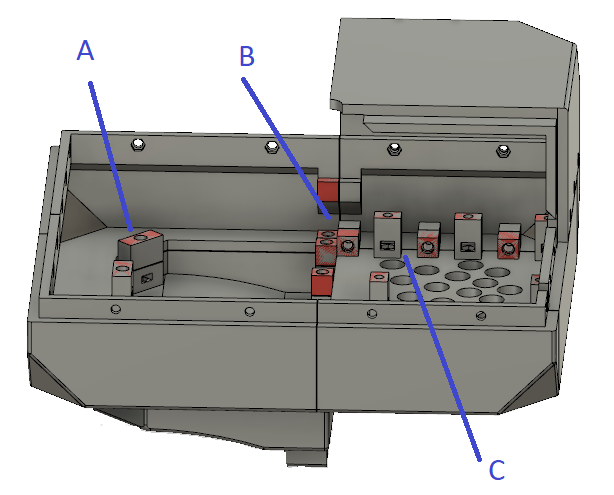
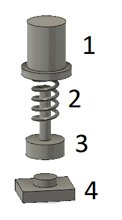

# Carcasa

## Botonera derecha

## Botonera izquierda

## Soportes

Los tipos de soportes son los siguientes:

En la siguiente figura se indica su ubicación (deben ser pegados):

## Botones

Los botones están compuestos de dos piezas impresas en 3D (1 y 3), un resorte (2) y el pulsador (4):

